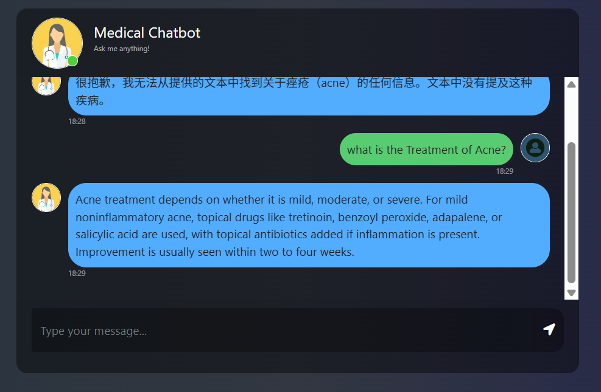
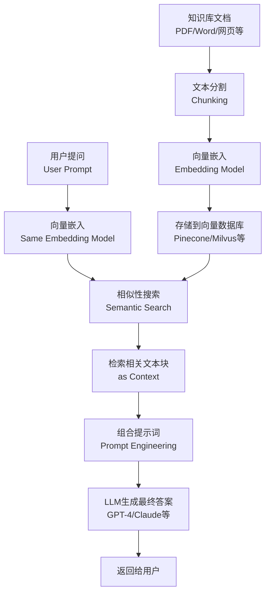

# medical-chatbot-full-stack

## 概述

本项目实现了一个基于 RAG 思想和本地知识库的医疗咨询机器人，交互方式为 Web 页面。

## 技术栈

- 使用 LangChain 框架调用“gemini-2.5-flash”模型，搭建智能体。
- 使用 RAG 思想及 Pinecone 数据库构建本地知识库。
- 使用 Flask 框架及 Jinja2 模板构建前端和后端。
- 使用 GitHub Action 进行 CI/CD，将项目部署在 AWS 云服务中。

## 项目仓库

- GitHub: https://github.com/Jerrybaijy/medical-chatbot-full-stack
- Docker Hub: https://hub.docker.com/repository/docker/jerrybaijy/medical-chatbot-full-stack

## RAG

